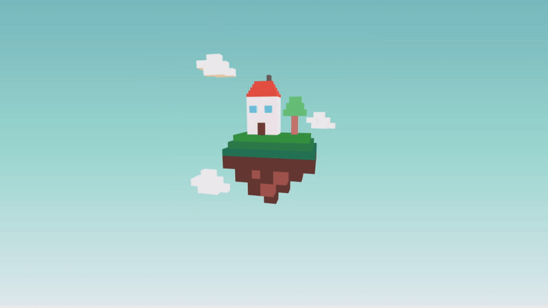

# Cubes Project

di Eleonora Artich e Caterina Cervellin

# Descrizione

Il progetto consiste nella messa in scena di un paesaggio di fantasia, composto da una casa fluttuante tra delle nuvole ancorata a un pezzo di terreno.

## Oggetto

La scena è composta da una casa dotata di tetto, camino, porte e finestre, e appoggiata su un prato che sormonta un segmento di terreno roccioso. Delle nuvole fanno da cornice all'abitazione sospesa, mentre l'animazione di un cubo simula la fuoriuscita di fumo dal camino. La scelta dei colori è ricaduta su cromie elementari ma vivaci, così da connotare al meglio gli elementi dell'ambientazione. Lo sfondo è definito da un gradiente di tre colori disposti in scala crescente per saturazione per simulare l'effetto dell'atmosfera che, all'aumentare dell'altitudine, si fa sempre più rarefatta.

## File usati

Il progetto `cubes-artich_cervellin-master` è composto da:

- `CubesProject-artich_cervellin.html`: file *.html* della scena;
- `journal.md`: documento di testo che riporta gli aggiornamenti del progetto;
- `readme.md`: questo documento di testo riassuntivo del progetto;
- `images`: cartella che contiene le immagini usate in readme.md e journal.md;
- `lib`: cartella che contiene le librerie di *Three.js*;
- `modules`: cartella che contiene la scena esportata da *Three.js Editor*;
- `video`: cartella che contiene il video finale della scena.

# Processo

Dopo un primo brainstorming per la scelta del soggetto, è stata creata una rapida bozza su Photoshop dell'aspetto del progetto finale. La scena è stata modellata su Three.js Editor posizionando, scalando e rotando 81 cubi. Sempre nell'editor sono stati assegnati i materiali (`MeshStandardMaterial`, `MeshBasicMaterial` e `MeshLambertMaterial`) e i relativi colori alle mesh. Sempre nell'editor sono state aggiunte luci e camera, che però sono poi state meglio implementate direttamente nel codice. La scena è stata esportata dall'editor in formato `.json`, ed è stata importata poi nel file fornito `StartingCode-withLights.html`. É stata poi implementata un loop di animazione del fumo definendo la posizione di partenza e di arrivo di un cubo e diminuendone la scala e l'opacità. Nel codice è stato aggiunto un gradiente per lo sfondo ed è stata modificata l'intensità delle luci. Infine sono stati realizzati un breve video e una gif per la presentazione del progetto nella documentazione, tramite la cattura video dello schermo e la sua rielaborazione.

## Tools

**Photoshop**: creazione della bozza del progetto, rielaborazione immagini per file di testo;

**Three.js Editor**: creazione della scena, applicazione dei materiali, creazione luci e camera (non definitive);

**Visual Studio Code**: editor del codice in HTML;

**VLC**: cattura video dello schemo;

**Shotcut**: video editor;

**Typora**: creazione file di testo in formato .md.

