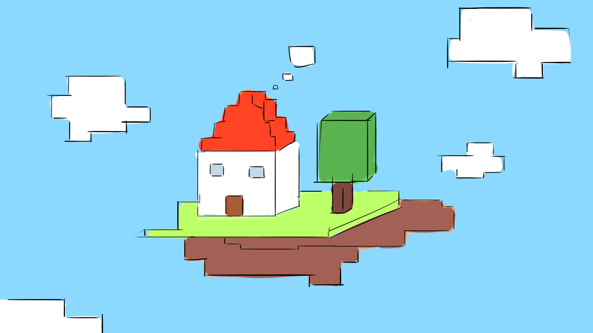
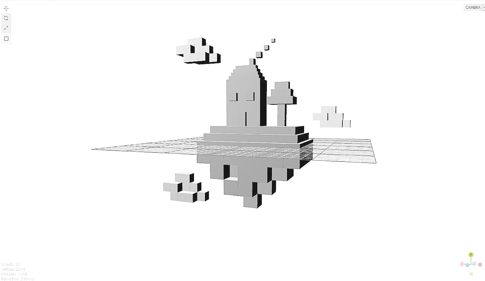
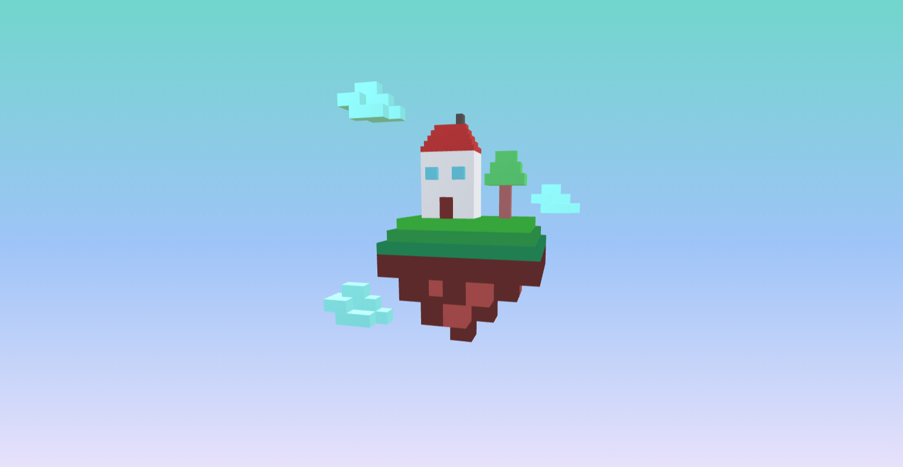
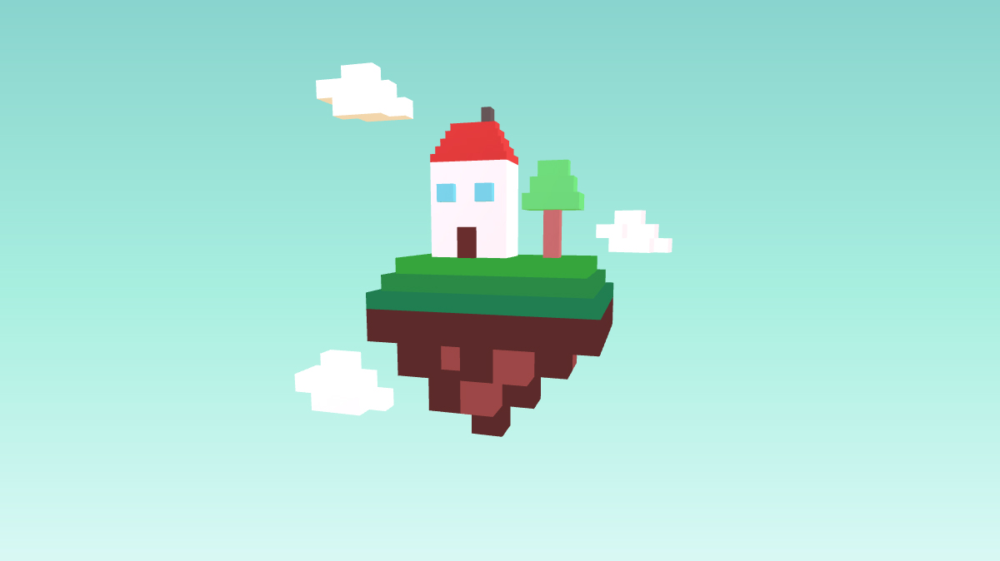

# Cubes Project Journal

di Eleonora Artich e Caterina Cervellin

08 novembre 2020

Impostazione e organizzazione scaletta di lavoro secondo i vari step da eseguire e gli elementi da creare:

- disegno base in *Photoshop*;
- utilizzo *Three.js Editor* per creare geometria, luci e materiali;
- importazione del modello;
- aggiunta colore di sfondo;
- animazione;
- video.

Brainstorming iniziale sull'idea del soggetto del modello terminato con la scelta della *Casa sospesa*.

------

09 novembre 2020

Visualizzazione della scena finale con una bozza in *Photoshop*.

______________

11 novembre 2020

Creazione del modello 3D su Three.js Editor:

- creazione cubi;
- creazione degli elementi della scena: casa, albero, terreno, nuvole;
- creazione della camera (*OrthographicCamera*);
- creazione della luce (*PointLight*);
- definizione materiale e colori del materiale (*MeshBasicMaterial*).

----------------

12 novembre 2020

Inserimento del modello nel codice di partenza *StartingCode-withLights*. Ridefinizione della camera e della luce che non vengono esportate dal *Three.js Editor*.

----------------------

15 novembre 2020

Creazione del fumo che esce dal camino con l'animazione di un cubo che trasla, scala e cambia in opacità.

---------------

16 novembre 2020

Video finale.

--------

29 gennaio 2021

Impaginazione dei file descrittivi del progetto, controllo generale del lavoro svolto, aggiustamenti luci della scena e colori dello sfondo e delle nuvole.

Inserimento in *GitHub*.